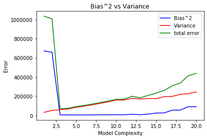

# MDL-Assignment-1
Assignment of Machine Data and Learning  | Spring 2021

## Team
- [Veeral Agarwal](https://github.com/veeral-agarwal)
- [P.Sahithi Reddy](https://github.com/psahithireddy)

# TASK 0
### LinearRegression().fit()
**LinearRegression()** is a estimator that fits the data (training data) using **.fit()** method and constructs the best-fit line or multidimensional model.We can use LinearRegression estimator to fit lines, planes, or hyperplanes to our data.
    This can be extended to fit polynomials.The idea is to take our multidimensional linear model:
    y=a<sub>0</sub>+a<sub>1</sub>x<sub>1</sub>+a<sub>2</sub>x<sub>2</sub>+a<sub>3</sub>x<sub>3</sub>+⋯
and build the x<sub>1</sub>,x<sub>2</sub>,x<sub>3</sub>, and so on, from our single-dimensional input x. That is, we let x<sub>n</sub>=f<sub>n</sub>(x), where f<sub>n</sub>() is some function that transforms our data.

For example, if f<sub>n</sub>(x)=x<sub>n</sub>, our model becomes a polynomial regression:
y=a<sub>0</sub>+a<sub>1</sub>x+a<sub>2</sub>x<sup>2</sup>+a<sub>3</sub>x<sup>3</sup>+⋯
This is still a linear model—the linearity refers to the fact that the coefficients an never multiply or divide each other.

**LinearRegression().fit()**(X, y, sample_weight=None)

    Parameters:
       X{array-like, sparse matrix} of shape (n_samples, n_features)
       Training data

       yarray-like of shape (n_samples,) or (n_samples, n_targets)
       Target values. Will be cast to X’s dtype if necessary

       sample_weightarray- like of shape (n_samples,), default=None
       Individual weights for each sample
       
       Returns:selfreturns an instance of self.


# TASK 2


### Task 2.2.1
Here we are loading the test and train data using pickle.load.We are randomising using random.shuffle and then separating x and y coorodinates.Then we split train data into 10 sets.So now we have 10 train sets of 800 data points each and a test set of 80 data points. 


```python
#import all libraries
import numpy as np
import pickle 
import matplotlib.pyplot as plot
from sklearn.preprocessing import PolynomialFeatures
from sklearn.linear_model import LinearRegression
import pandas as pd

#get train data
with open('./train.pkl', 'rb') as train:
    data1 = pickle.load(train)
    
#shuffle data everytime to get diff models
np.random.shuffle(data1)

#getting x and y coordinates separately
x_tr=data1[:,:-1]
y_tr=data1[:,1]

#get test data
with open('./test.pkl','rb') as test:
    data2 = pickle.load(test)
x_test=data2[:,:-1]
y_test=data2[:,1]
#print(y_test)

#split train data into 10 sets
x_train=np.array(np.array_split(x_tr,10))
y_train=np.array(np.array_split(y_tr,10))

```

### Task 2.2.2
Predict the bias and variance of degree 1-20

LOGIC:
   For each degree , run a loop on 10 models.For each model predict the values on test data , and take average over all the 10 models to get predicted value of that degree over test data.Using that we calculated bias and variance and meansquare error.We are using polynomial.fit transform to make single dimensional data points to polynomial regression as we presented the idea in task1.
   


```python
#declare bias and variance array of size 20 
bias=np.zeros(21)
biassq=np.zeros(21)
variance=np.zeros(21)
irred_error=np.zeros(21)
tot_err = np.zeros(21)

reg = LinearRegression()
#for each degree run fit on 10 models,800 data points each,pass test data and get output
for i in range(1,21): 
    difference = np.zeros((10,80))
    temp=np.zeros(80)
    y_return=np.zeros((10,80)) #create output array to get predicted values
    for j in range(10):
        polynomial = PolynomialFeatures(degree=i , include_bias=False)
        
        X_TRAIN = polynomial.fit_transform(x_train[j])
        X_TEST = polynomial.fit_transform(x_test)
        
        reg.fit(X_TRAIN , y_train[j])
        
        prediction = []
        prediction = (reg.predict(X_TEST))
        y_return[j]=prediction
        difference[j] = ((y_test - y_return[j])**2)
    
       
    
    for j in range (10):
        temp += difference[j]
    
    temp /= 10 #meansqaureerror
    tot_err[i] = np.mean(temp)
    #for each degree ,calculate bias and bias**2
    y_mean=np.mean(y_return,axis=0)
    bias[i]=np.mean(abs(y_mean - y_test))
    biassq[i] = np.mean((y_mean - y_test)**2)
    
    # for each degree , calculate variance
    y_var=np.var(y_return,axis=0)
    variance[i]=np.mean(y_var)
   
    
    #calculate irreducible error

    irred_error[i]=np.mean(temp) - (biassq[i] +variance[i])
    #print("irreducible error",i,"--",irred_error[i])
    
    

    


```

### Tabulating Bias and Variance


```python

bias[0]=None
variance[0]=None
irred_error[0]=None 
tot_err[0]=None
table_bias=pd.DataFrame({'Degree':np.array(range(0,21)),'Bias':bias,'Variance': variance})
print(table_bias.to_string(index=False))
```

     Degree        Bias       Variance
          0         NaN            NaN
          1  819.767714   31381.957256
          2  810.802246   52100.526227
          3   67.245162   59157.457030
          4   75.130127   66323.061164
          5   73.500814   83913.457303
          6   71.483891   95998.664895
          7   76.098030  109892.203483
          8   77.354926  125128.129832
          9   79.373786  140563.954217
         10   82.855766  158544.131429
         11   79.453672  160643.330932
         12  110.003673  177439.551963
         13   82.371019  171022.992005
         14  117.822281  175294.811045
         15  156.379072  174583.023010
         16  160.609540  194948.688394
         17  233.498460  197679.419117
         18  234.735012  218908.095223
         19  300.570009  226504.118436
         20  300.350744  243783.056783


**Bias** is the difference between the average prediction of our model and the correct value which we are trying to predict.
   If bias is high ,that means our is too poorly fit.
       
**Variance** is the variability of model prediction for a given data point. Model with high variance pays a lot of attention to training data and does not generalize on the data which it hasn’t seen before.
   

    
    

### Bias-Variance as function classes change:

   At polynomial hypothesis of degree 1 and 2,bias value is too high and variance is low which indicates the restricted flexibility of the model.At polynomial of degree 3 it suddenly drops to lowest bias and low variance. As polynomial complexity increases the bias value fluctuates between 75-85,and variance show continous rise.But as complexity increases further we see increase in bias value and continous increase in variance which indicates that the model became too complex for simple dataset.
   [More in Further analysis]

# Task 3
### Tabulating irreducible error


```python
table_bias=pd.DataFrame({'Degree':np.array(range(0,21)),'Irreducible Error':irred_error})
print(table_bias.to_string(index=False))
```

     Degree  Irreducible Error
          0                NaN
          1       0.000000e+00
          2       2.328306e-10
          3       0.000000e+00
          4       1.455192e-11
          5       2.910383e-11
          6       0.000000e+00
          7       0.000000e+00
          8       0.000000e+00
          9       0.000000e+00
         10      -2.910383e-11
         11       0.000000e+00
         12       2.910383e-11
         13       5.820766e-11
         14       2.910383e-11
         15       2.910383e-11
         16       0.000000e+00
         17      -5.820766e-11
         18       5.820766e-11
         19       0.000000e+00
         20       1.164153e-10


### Report on Irreducible error:
            Irreducible error= mean_squared_error- (bias^2 + variance) 
   **Irreducible error** is the error that can’t be reduced by creating good models.In this data error seems to be close to zero, fluctuating between -1 to 1.It is almost same for all the classes.It is same because it is the measure amount of noise in data ,which can't be avoided by creating good models.So since it doesn't depend on model complexity,all values are same. 
   One thing we can observe is error is almost zero, which indicates our test set has very low noise and good data.
            
               


# TASK 4
### Plotting Bias^2-Variance Graph


```python

plot.plot(bias**2,label='Bias^2', color = 'blue')
plot.plot(variance,label='Variance', color = 'red')
plot.plot(tot_err,label='total error', color = 'green')
plot.xlabel('Model Complexity', fontsize='medium') 
plot.ylabel('Error', fontsize='medium') 
plot.title("Bias^2 vs Variance") 
plot.legend()
```





### Analysis:

**Underfitting** refers to a model that can neither model the training data nor generalize to new data.Occurs when a function  is too loosely fit.
    
**Overfitting** is a modeling error that occurs when a function is too closely fit to a limited set of data points. 

   -Initially bias seems to be high and variance seems to be low till model complexity reaches 2.5.Hence we can conclude that for polynomial of degree1 and 2 the model is undergoing underfitting which implies that model is too simple. 
   
   -At model complexity 3 bias is low and variance is low, also total error seems to be low too, so we can say that the polynomial of degree 3 may be the best fit for this model.
   
   -As model complexity increases variance sees a steady increase , bias seems to decrease/remain same for polynomials of degree 3 to 11 ,which indicates that the model is undergoing overfitting,which means the model have fit in too much.
   
   -From model complexity increases further from 12 to 20 we can see that bias starts going up,which suggests we are using too complex polynomial for a simple model,which is also a indication that we can stop increasing complexity and choose from the simpler ones.Note that variance still sees a steady rise.
   
   
   
   
   
